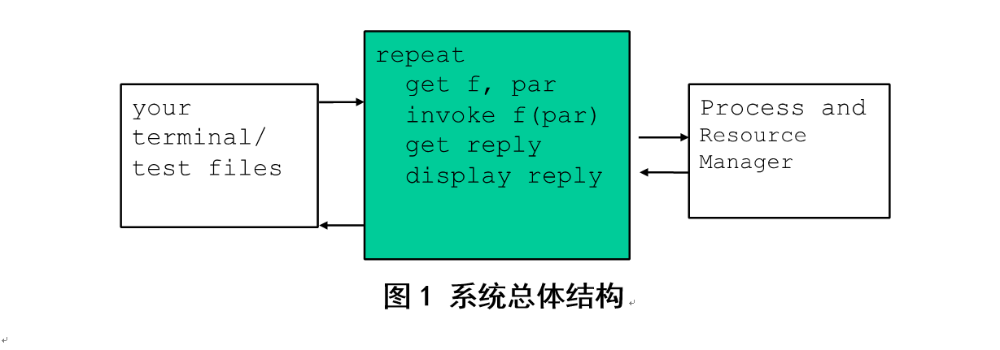

# process-resource-management
 <b>主要内容：</b> 
设计并实现一个基本的进程与资源管理器。该管理器能够完成进程的控制，如进程创建与撤销、进程的状态转换；能够基于优先级调度算法完成进程的调度，模拟时钟中断，在同优先级进程中采用时间片轮转调度算法进行调度；能够完成资源的分配与释放，并完成进程之间的同步。该管理器同时也能完成从用户终端或者指定文件读取用户命令，通过Test shell模块完成对用户命令的解释，将用户命令转化为对进程与资源控制的具体操作，并将执行结果输出到终端或指定文件中。

